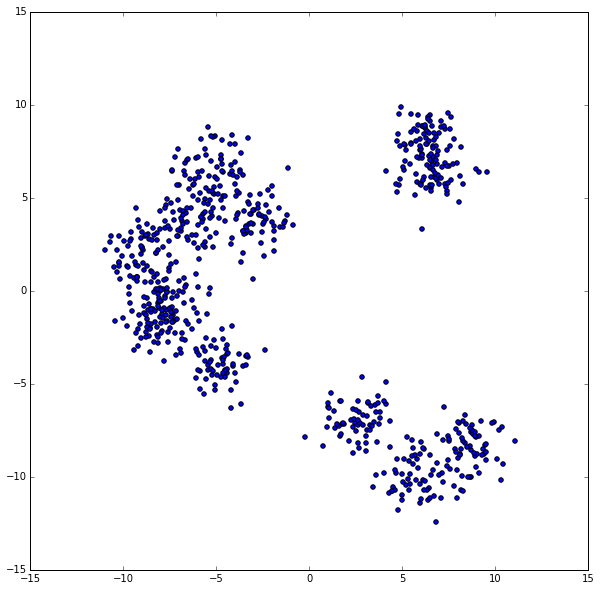
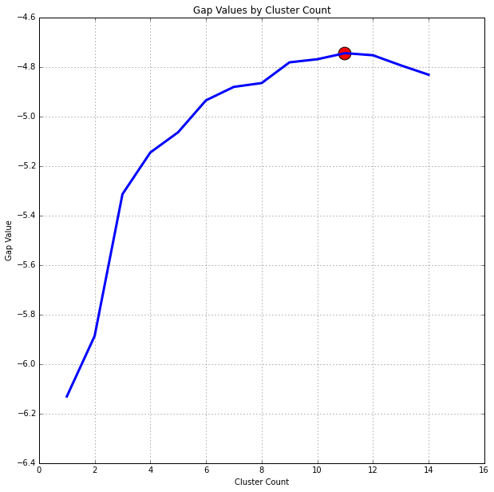
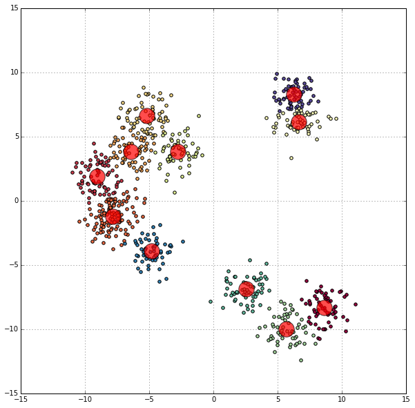

## gap_statistic
### Python implementation of the [Gap Statistic]('gap statistic' http://www.web.stanford.edu/~hastie/Papers/gap.pdf) using pandas, numpy, and SciKit-Learn

---
#### Purpose
Dynamically identify the number of clusters using KMeans iteratively to calculate the gap statistic for each possible cluster count from 1 to maxClusters. Identifies the optimal cluster count in that range by returning the cluster count which resulted in the highest gap statistic

---

#### Usage:

<p><code>from gap_statistic.optimalK import optimalK</code></p>

Parameters:
- data: ndarray of shape (n_samples, n_features)
- nrefs: number of random sample data sets to produce
- maxClusters: maximum number of clusters to look for

---
#### Install:

cd into site-packages directory and run: <p><code>git clone https://github.com/milesgranger/gap_statistic.git</code></p>

---

### Full example...


```python
%matplotlib inline

import matplotlib.pyplot as plt
import pandas as pd
import numpy as np

from gap_statistic.optimalK import optimalK
from sklearn.datasets.samples_generator import make_blobs
from sklearn.cluster import KMeans

plt.rcParams['figure.figsize'] = 10, 10
```


```python
x, y = make_blobs(750, n_features=2, centers=6)

plt.scatter(x[:, 0], x[:, 1])
plt.show()
```





```python
# Give the data to optimalK with maximum considered clusters of 15
n, gapdf = optimalK(x, nrefs=3, maxClusters=15)
print 'Optimal Clusters: ', n

plt.plot(gapdf.clusterCount, gapdf.gap, linewidth=3)
plt.scatter(gapdf[gapdf.clusterCount == n].clusterCount, gapdf[gapdf.clusterCount == n].gap, s=250, c='r')
plt.grid(True)
plt.xlabel('Cluster Count')
plt.ylabel('Gap Value')
plt.title('Gap Values by Cluster Count')
plt.show()
```

    Optimal Clusters:  6





```python
# Now that we have the optimal clusters, n, we build our own KMeans model...
km = KMeans(n)
km.fit(x)

df = pd.DataFrame(x, columns=['x','y'])
df['label'] = km.labels_

colors = plt.cm.Spectral(np.linspace(0, 1, len(df.label.unique())))

for color, label in zip(colors, df.label.unique()):
    
    tempdf = df[df.label == label]
    plt.scatter(tempdf.x, tempdf.y, c=color)
    
plt.scatter(km.cluster_centers_[:,0], km.cluster_centers_[:, 1], c='r', s=500, alpha=0.7, )
plt.grid(True)
plt.show()
```





```python

```
